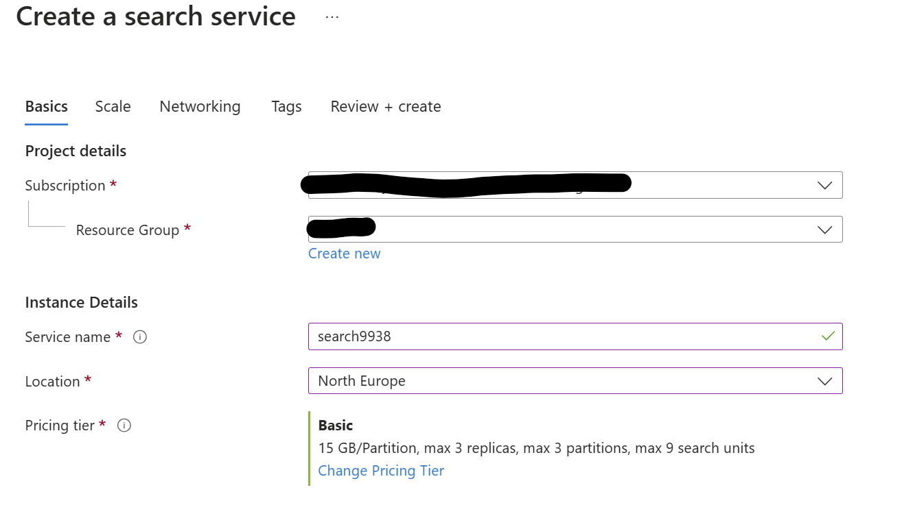
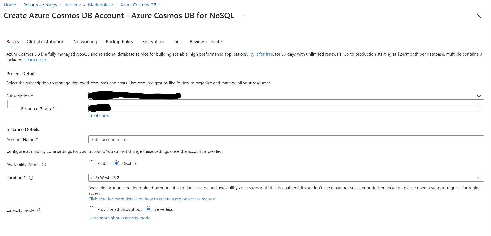

# Introduction to Autonomous Agents Workshop


This repository introduces and helps organizations to get started with creating autonomous agents for relevant business scenarios.

## Workshop Agenda
The objective of this workshop is to discuss realistic autonomous agent business scenarios and to learn how to leverage the **AutoGen** framework for development. At the end of the workshop you will:

- Understand agentic reasoning and the core concepts behind agents
- Understand what agents can do and how to leverage them to maximize the impact for the business
- Be able to create autonomous agents from scratch using **AutoGen**
- Learn relevant business scenarious for autonomous agents

| Topic                          | Details                                                                                                                          | Comments |
| ------------------------------ | -------------------------------------------------------------------------------------------------------------------------------- | -------- |
| Autonomous Agents Introduction | - From LLMs to autonomous agents <br> - Agent framework capabilities and market overview                                         | 20 min   |
| AutoGen                        | - AutoGen overview: concepts and capabilities <br> - Building a multi-agent conversation from scratch <br> - AutoGen Studio Demo | 60 min   |
| Business scenarious: Demos     | - Simplified troubleshooting customer service demo <br> - Onboarding buddy demo <br> - Guided image generation demo              | 60 min   |
| Envisioning                    | - Identification of potential use cases <br> - PoC scope definition                                                              | 90 min   |

## Setting up the resources

For executing our demos, Docker and the following Azure services are needed: Azure OpenAI, Azure AI Search and Cosmos DB. 
The sample data used for the simple demos is stored under `utils/sample_data`.

**Azure OpenAI**

An Azure OpenAI resource with the following model deployments is needed:
- GPT-4o
- Text-embedding-ada-002
- DALL-E 3

It is recommended to select an Azure region that provides all the above models like **Sweden Central**.

**Azure AI Search**

[List of supported regions for semantic ranking](https://learn.microsoft.com/en-us/azure/search/search-region-support)

We need to create AI search in one of the regions where semantic ranking feature is enabled.



`Basic` tier would be sufficient for demo purposes, however if your index size is larger, consider reviewing the [list of supported tiers](https://learn.microsoft.com/en-us/azure/search/search-sku-tier).


**Cosmos DB with sample data**

To set up CosmosDB, choose the CosmosDB for NoSQL and the `Serverless` capacity option.




## Python environment

Create and activate a virtual Python environment for running the app.
The following example shows how to create a Conda environment named `autogen`:

```bash
conda create -n autogen python=3.12
conda activate autogen
```
Install the required packages:

```bash
pip install -r requirements.txt
```

**Authentication and access management**

Edit the file `dotenv-template` to provide the credentials for your services. Leave values for optional services blank if you don't intend to use them. After editing, rename the file from `dotenv-template` to `.env`.

The repository is using key-based authentication for Azure OpenAI and Azure AI Search.

`DefaultAzureCredential` is used for authentication to CosmosDB. Alternatively, you can use key-based authentication if your Azure policies allow this authentication method. Refer to the [documentation](https://learn.microsoft.com/en-us/python/api/overview/azure/identity-readme?view=azure-python) to learn more.


